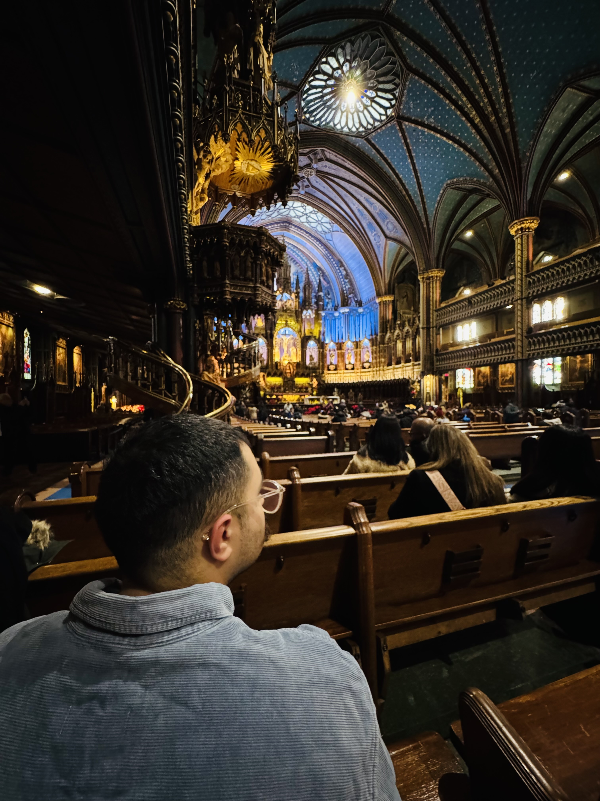

# Mohammadreza (Hamid) Matiny

  
  
  

  

## 👋 About Me

Results-driven **Machine Learning Engineer** and **Data Annotator** with strong expertise in autonomous vehicle perception, AI/ML, and deep learning. I bring:

- 1+ years of direct experience at **Torc Robotics** annotating LiDAR and camera data for autonomous trucks
- 5+ years as a Data Scientist building perception models (2D/3D object detection, tracking, sensor fusion)
- Deep knowledge of PyTorch-based offline auto-labeling pipelines, pseudo‑labeling and MLOps (Docker, FastAPI, cloud deployment)

I’m passionate about high‑quality annotations and robust perception systems that power safe autonomy. This repository (also my [portfolio site](https://hamidmatiny.github.io)) showcases my work, skills, and projects.

## 🚀 Key Projects

- **Auto-Driving / LiDAR-Radar Fusion** – Developed 3D object detection & tracking with multi-sensor fusion (LiDAR + Radar) using PointPillars and custom architectures. Optimized for adverse weather (fog/rain).
- **ViT‑FastAPI‑Cloud‑Deploy** – Deployed a Vision Transformer (ViT) on CIFAR‑10 via FastAPI, Docker, and Google Cloud App Engine. Achieved ~40 % latency reduction through MLOps tuning.
- **Cuda Optimization** – Optimized deep‑learning models (Transformers, ViT) on Apple M3 (MPS) using AMP, torch.compile, gradient checkpointing, and DataLoader tuning – achieved 2–4× speedups and ~60 % memory savings.
- **Advanced Deep Learning** – Built Transformers (from scratch + Hugging Face), RNNs/LSTMs, seq2seq with attention, applied to semantic segmentation and BEV tasks.
- **MLOps & Deployment** – End‑to‑end pipelines with Dockerized models, FastAPI serving, Google App Engine/Cloud Run deployments, logging and monitoring.

## 🛠 Technical Skills

**Perception & AV:** 2D/3D object detection, tracking, sensor fusion (LiDAR, Radar, Cameras), pseudo‑labeling, active learning, semantic segmentation, BEV, YOLOv5/7/8, PointPillars

**ML Frameworks & Tools:** PyTorch, Lightning, Hugging Face Transformers, MLflow, Weights & Biases, Docker, GitHub Actions (CI/CD)

**Data Ops:** Parquet (PyArrow, Pandas), data curation & governance, vector databases, schema design

**Development:** Python (expert), FastAPI, Flask, SQL, Git, GCP App Engine, AWS basics

**Optimization:** Mixed precision (AMP), torch.compile, gradient checkpointing, MPS/CUDA profiling

**Visualization:** Matplotlib, Seaborn, Open3D (point clouds), Tableau

## 💼 Experience

**Machine Learning Engineer & Data Annotator** – *Torc Robotics* (2024 – Present)

- Annotated LiDAR/camera data for autonomous trucks
- Built and optimized perception models and auto-labeling pipelines
- Collaborated on YOLO-based systems and AV safety initiatives

## 🎓 Education

**B.Sc. Software Engineering** – Shahid Rajaei University (2011 – 2017)

## 📫 Contact

- ✉️ [hamidmatiny@gmail.com](mailto:hamidmatiny@gmail.com)
- 📞 +1 506‑471‑1611
- 📍 Fredericton, NB (willing to relocate)

  

---

> This page is built with Jekyll using the `time-machine` remote theme. Feel free to fork and customize!
